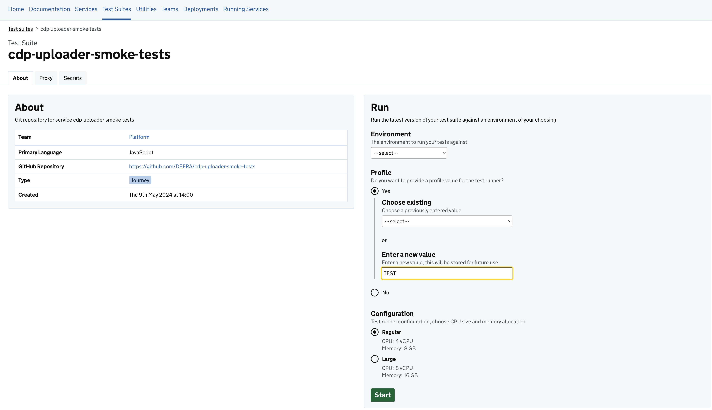

# New Feature: Passing profile to the test suite

You can now pass a profile `value` to a test-suite when running it on the CDP Platform. The value is sent to the
test-suite as the environment variable `PROFILE`. Profiles are a way of changing the behaviour of the test-suite without
changing the code.

## Motivation

When running tests it is often useful to be able to change the behaviour of the test suite without having to
change the code itself. This is especially useful when you want to run the same test suite in various different ways.

## New Profile Feature

An image of the new profile option in the test-suite runner form.

## Use Cases

A few example use cases would be to run the same test suite:

1. Against a different subset of tests (E.g. smoke tests)
1. With a varying performance test measure (E.g. number of users/requests per minute)

## Implementations

Potential implementation options would be:

1. Read the environment variable `PROFILE` and pass it into the `Dockerfile`
1. Use the environment variable `PROFILE` to load different config files within your test suite
1. Use the environment variable `PROFILE` to set flags in the test framework
1. Any other way that suits your test suite design

## Setting the profile value

For more information on how to set the value of the profile when running your test suite see the
[Running Test Suites with a profile value](https://portal.cdp-int.defra.cloud/documentation/how-to/testing/testing.md#passing-a-profile-to-the-test-suite)

## Feedback

As always any comments, feedback or feature requests please do start a conversation in
Slack [#cdp-support](https://defra-digital-team.slack.com/archives/C05UJ3SE5C6/)
